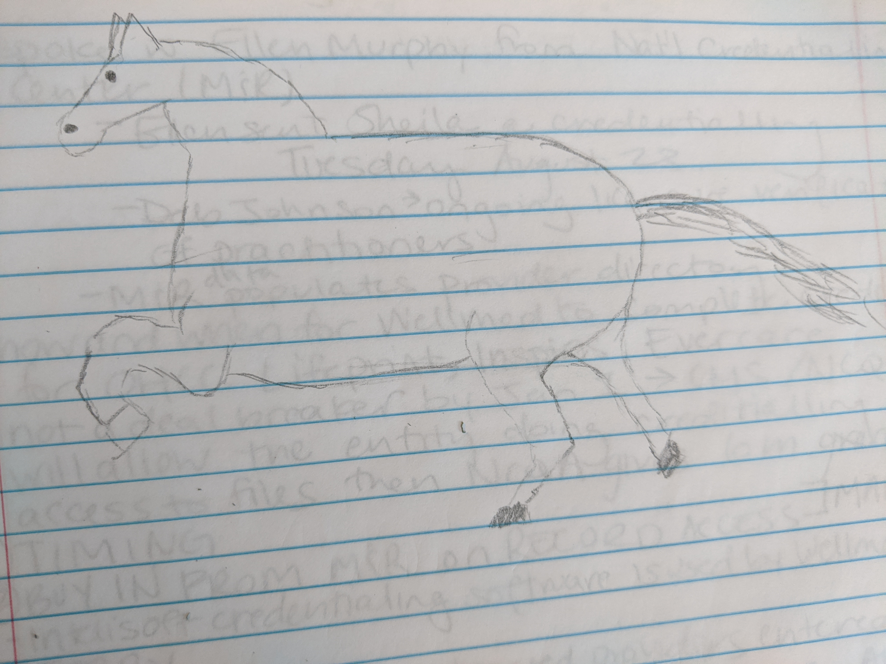
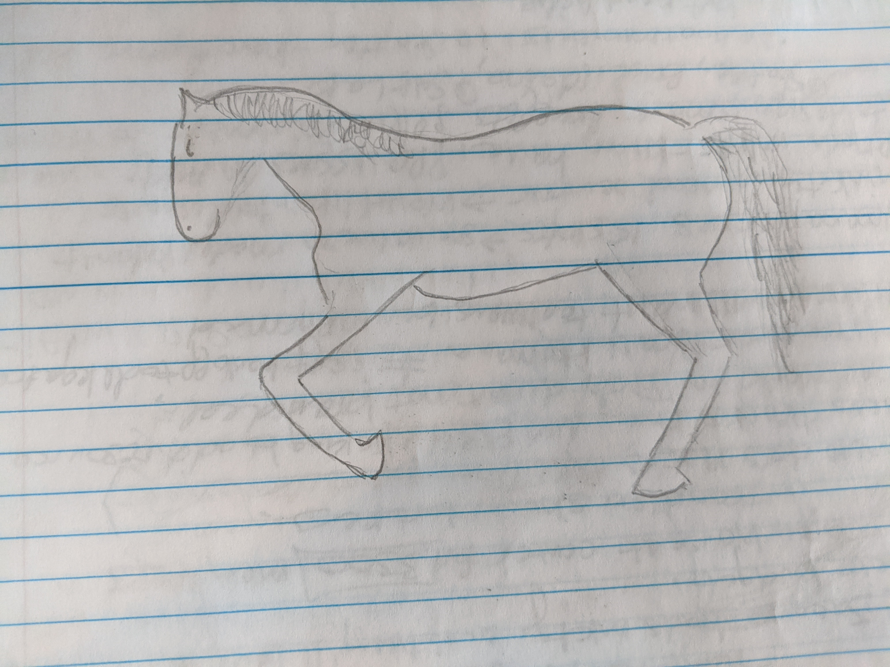

I am recording these animals mostly because of how bad they are. It's a good benchmark to one day look back on how bad I was.

My daughter said, "draw a lion", so I tried to draw it without looking at a reference. That creature above is what came up with.

Same deal with this horse:

But in the following days I did some Googling with the kids and did a little bit better with some models.

