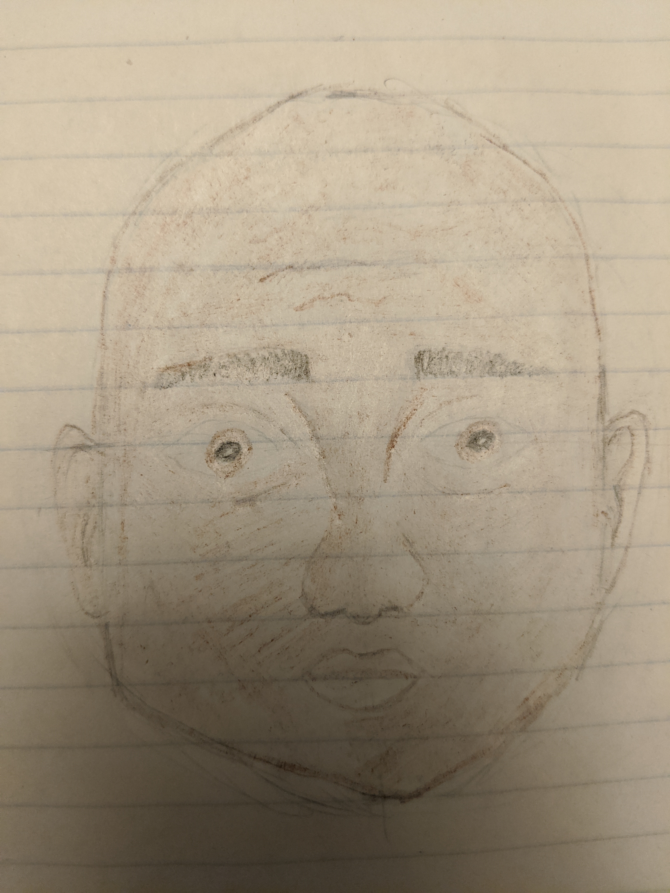
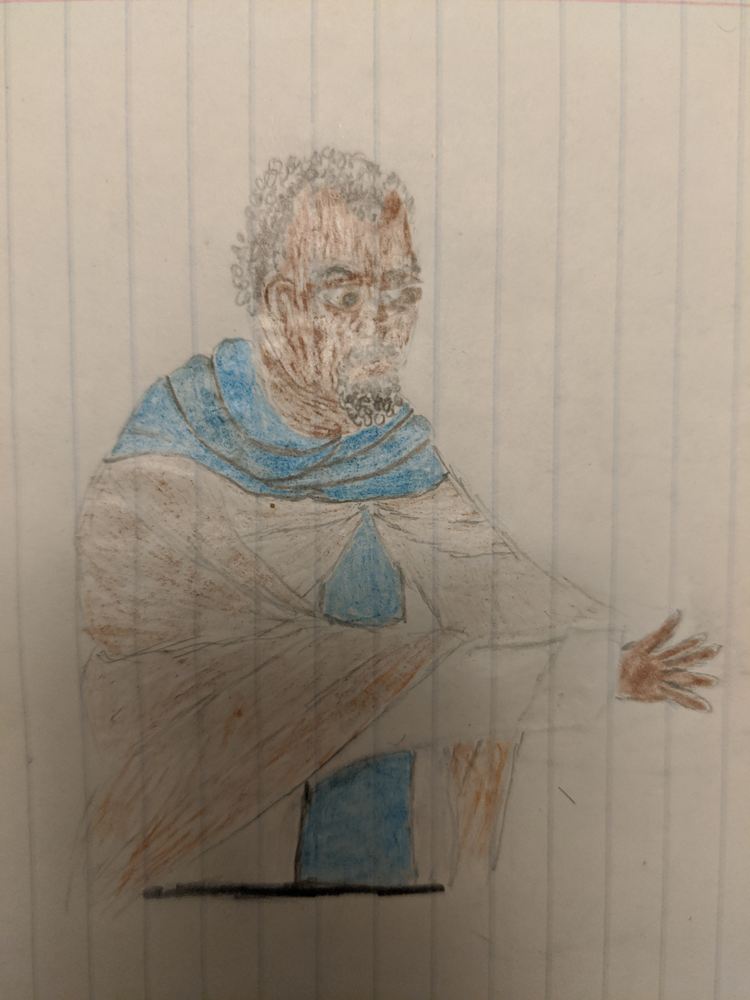

I've been scared to work with color - wanted to learn more basics first.

Not sure if I've "learned" the basics yet. But it seemed time to start learning about color, too.

In these drawings I can see some progress - at the same time I find it funny and surprising how bad they are. I feel too embarassed to save them - then I remember it'll be helpful to compare a year from now.
