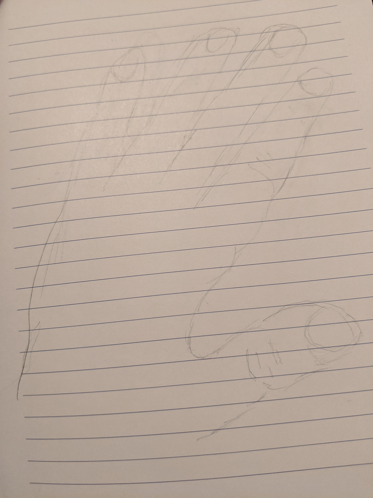
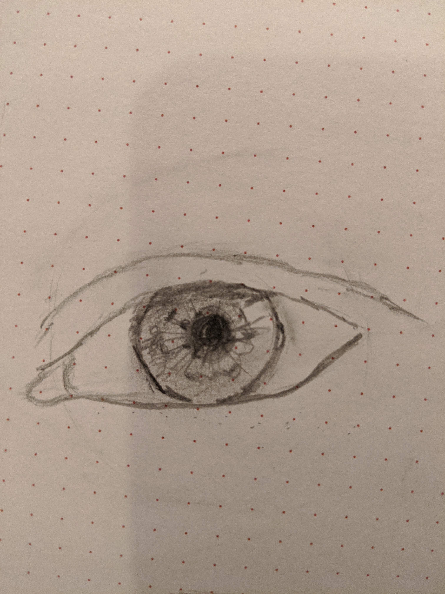

After spending a lot of time on drawing books with bold and eccentric pedagogical methods, I found this <a href="https://www.youtube.com/watch?v=iMEBSQJYaAY&t=458s" target="_blank">youtube</a> channel more helpful.

Capturing people's individuality is the greatest challenge and ultimate goal for me.

