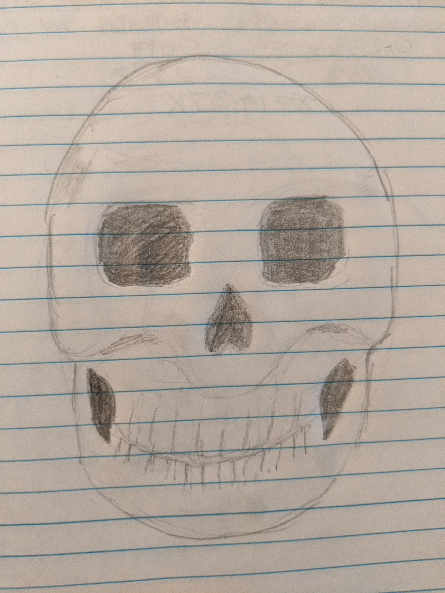
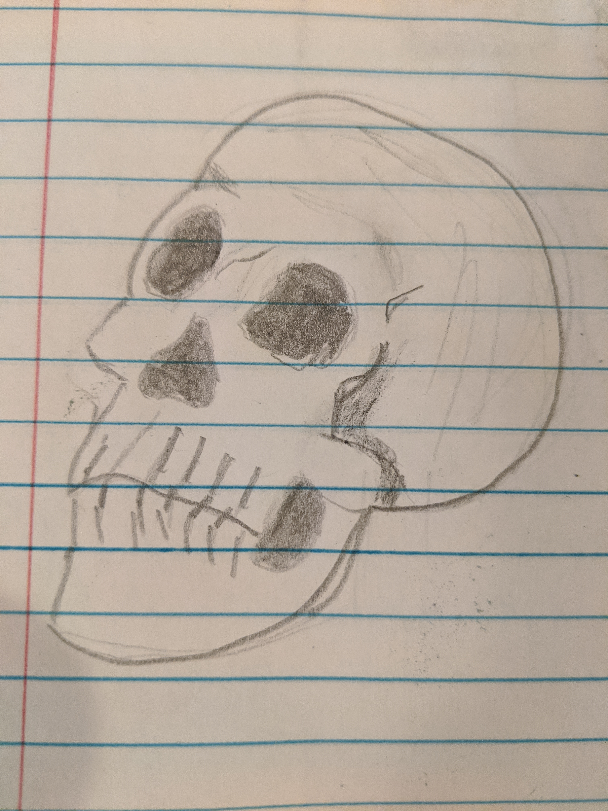

One of the drawing teachers I found online emphasized needing a deeper understanding of human anatomy to draw people well. They specifically said an artist should draw many skulls to better understand facial structure.

I like that kind of assignment.

