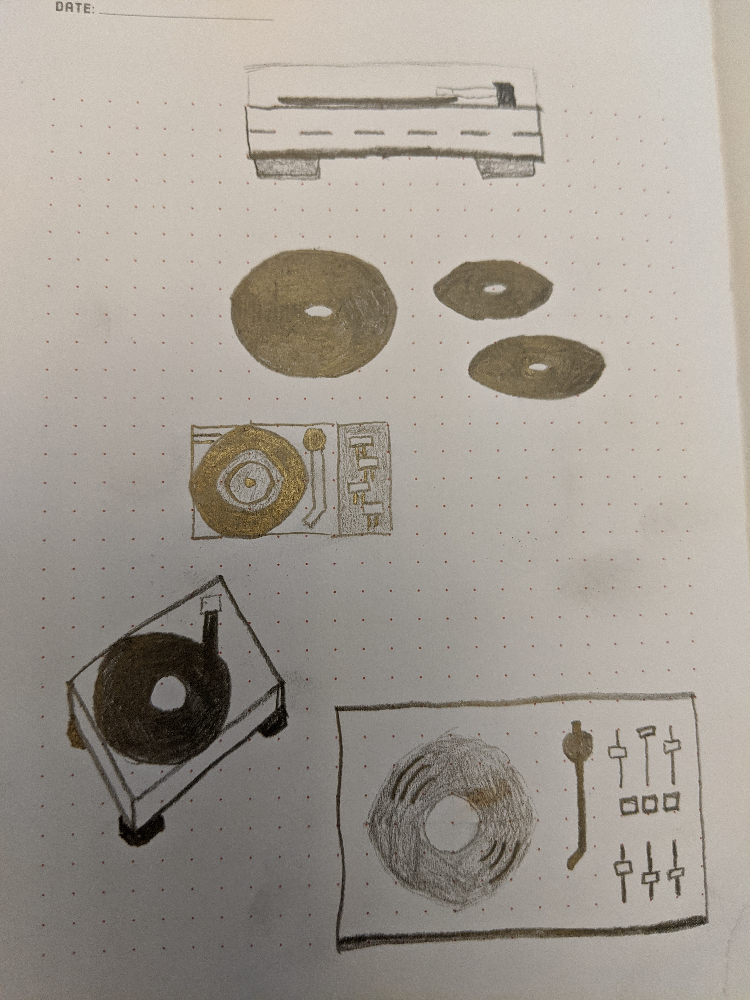

In my sporadic research of other artists I found an illustrator who
wanted to discipline himself as an artist by spending 1 year doing the same thing
everyday, refining his craft and ideas. So he drew a [White Ibis cartoon](https://www.struthless.com/prints) every day for a year.

That sounded like an interesting challenge.

I might devote some time to records or albums or something. Rap music was the first art
I had a relationship with. Every time I draw a record player or album I can enjoy,
reflect on, and pay homage to the music.

